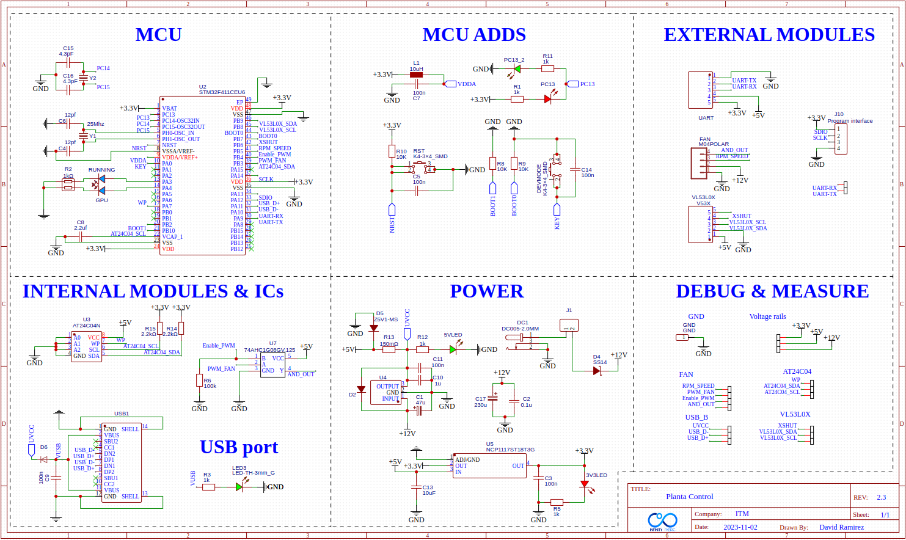
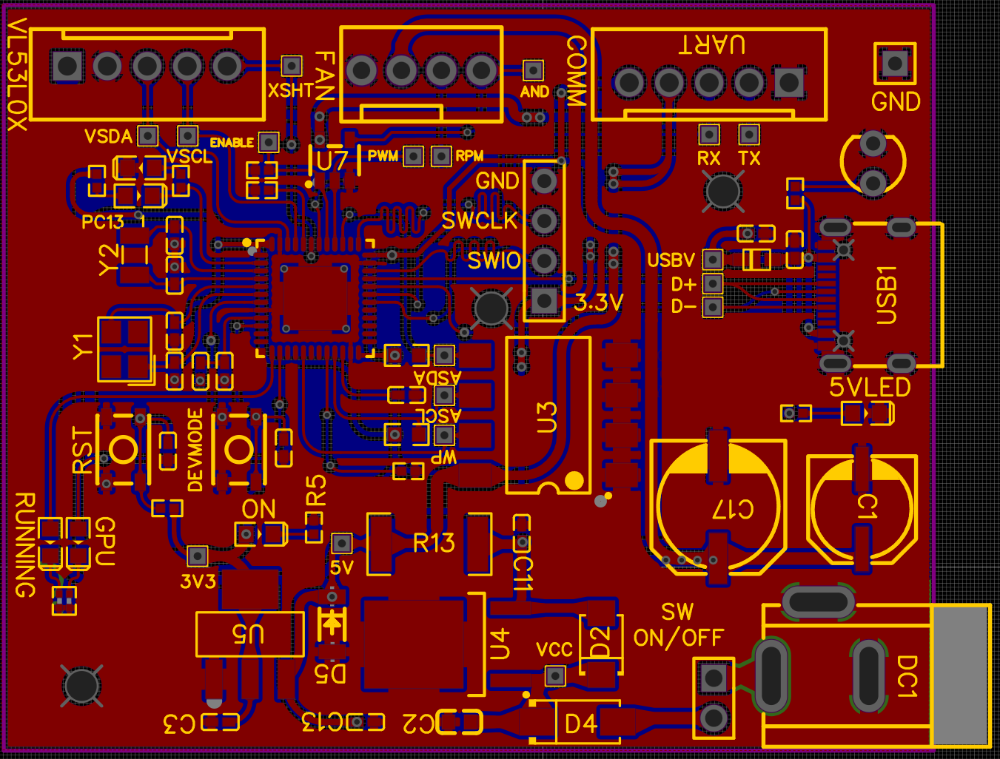
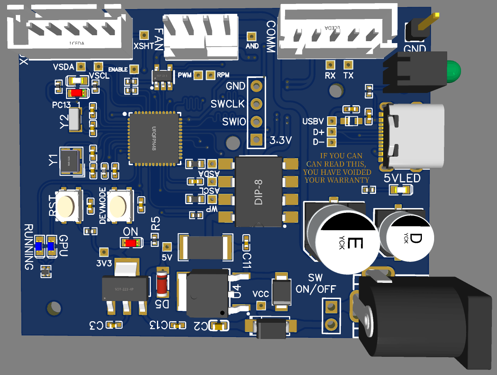
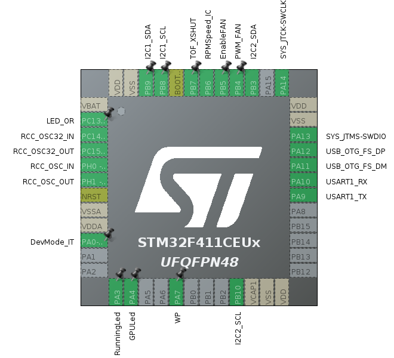
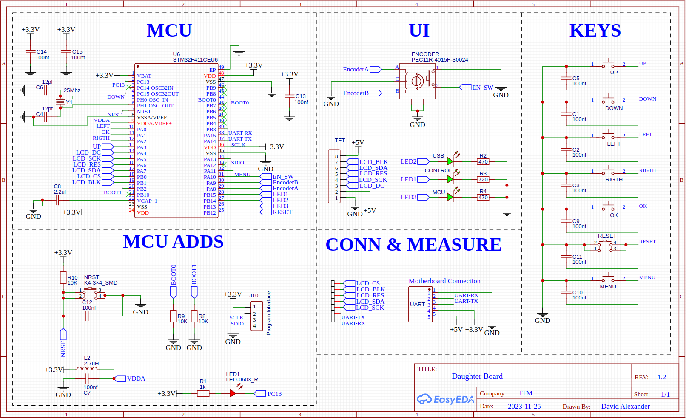
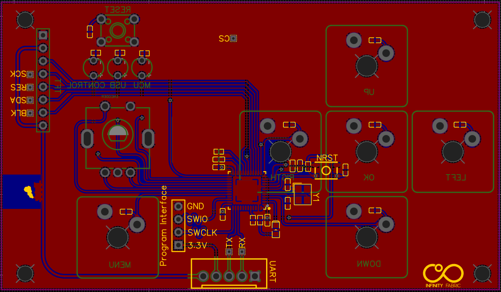
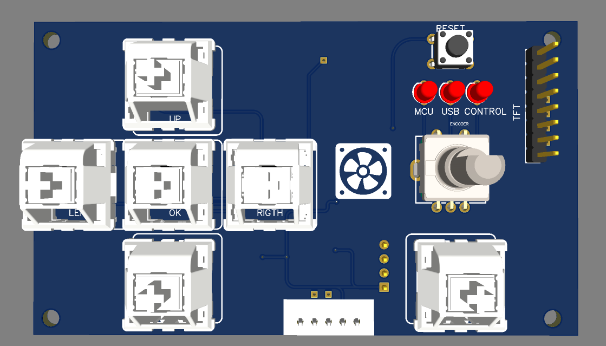
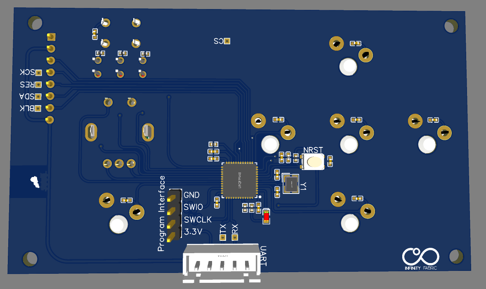
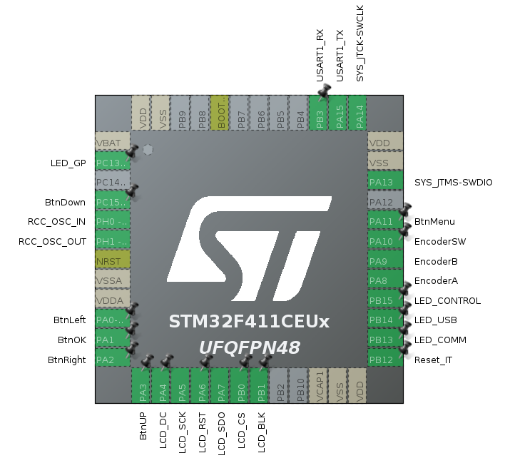

# PneumaticLevitator
This is a project for the Instituto Tecnológico de Morelia University for the Control lecture that helps the students to learn more about the digital PID control, and gives the oportunity to explore another new control laws since the project allows the communication via USB with Matlab, Python, Arduino Monitor, etc.

This project can be seen as a control plant, were the main objective is to control the vertical position of the unicel ball with the pneumatic force efectuaded by the CPU FAN
## Features
 - Internal PID for the control of the ball
 - External communication with USB (USB C Port), allowing the user implement another control law with Python or Matlab
 - Manual control with the encoder on the top of the project
## Hardware
This project has two main electronic boards each with it's own STM32F411CEU6, the main board is called Motherboard, and the slave board it's called Daughterboard
### Motherboard
   - Control the communication with the USB device
   - Handler of the internal PID
   - Controls the FAN
   - Receives the power and redistributes to the system
   - Has an EEPROM memory for the non-volatile data
   - Communication with Daughterboard via UART @ 921600 B/s 
   - Communicates and processes the distance sensor (VL53L0X)
   - Reports the errors with a led system
  #### Motherboard Schematic
  
  #### Motherboard Layout
  
  #### Motherboard 3D Model
  
  #### Motherboard STM32 Pinout
  
### Daughterboard
   - Interface and debounce the user buttons
   - Interface and incremental encoder that is used as a user interface
   - Communication with Daughterboard via UART @ 921600 B/s
   - Indicates the with leds the control modes
   - Works as a GPU with the LCD TFT Display via SPI @ 4MHz
   - Displays all the content of the GUI with a library called [μGUI](https://embeddedlightning.com/ugui/) and this fork for the [LCD Adaption](https://github.com/deividAlfa/ST7789-STM32-uGUI) on STM32
  #### Daughterboard Schematic
  
  #### Daughterboard Layout
  
  #### Daughterboard 3D Model Front
  
  #### Daughterboard 3D Model Back
  
  #### Daughterboard STM32 Pinout
  
## Memory consumption
Memory Consumption @ Release v0.1.0
Not dynamic memory allocation used at the moment (excluding the heap)
 #### Motherboard
 - RAM   ->  40.94%
 - FLASH ->  27.32%
 #### Daughterboard
 - RAM   ->  60.71%
 - FLASH ->  85.82%
 ## OS Details
 All the threads are allocated statically
 ### Motherboard
 - Heap Size: 20KB
 - Heap Usage: 24B (Memory pools not implemented yet)
   #### OS Threads
   |Task|Stack|Priority|Status|
   |----|-----|--------|------|
   |TaskWdgM|1KB|Realtime|Enabled|
   |TaskModeManager|512B|AboveNormal|Disabled|
   |TaskPID|1KB|AboveNormal|Enabled|
   |TaskCOM|2KB|High|Enabled|
   |SubTaskUSB|4KB|Normal|Enabled|
   |SubTaskUART|1KB|Normal|Enabled|
   |TaskDiagAppl|512B|Normal|Disabled|
   |TaskLeds|256B|AboveNormal|Enabled|
   |TaskSensor|1KB|AboveNormal|Enabled|
   |TaskFAN|512B|AboveNormal|Enabled|
 #### Daughterboard
 - Heap Size: 15KB
 - Heap Usage: 2.3KB
   #### OS Threads
   |Task|Stack|Priority|Status|
   |----|-----|--------|------|
   |TaskIdle (Will be removed soon)|256B|Low|Enabled|
   |TaskUI|40KB(This can be reduced)|Normal|Enabled|
   |TaskLeds|256B|BelowNormal|Disabled|
   |TaskWdgM|512B|Realtime|Enabled|
   |TaskCOM|4KB|AboveNormal|Enabled|
   |TaskDiagAppl|512B|Normal|Enabled|
   |TaskGPUResMan|1KB|AboveNormal|Enabled|
   |TaskHMI|1KB|High|Enabled|
## Requirements
- Hardware mentioned above
- STM32F411CEU6
- STLink Programmer
- STM32CubeIDE
## Topics used during the development
### Software Engineering
* Software Architecture
* Software Components
* Version Control
### Operative Systems
* Tasks
* Preemptive algorithm
* Round Robin algorithm
* Data structures
* Stack overflow
* Heap
* Heap algorithms
* Concurrency
* Binary semaphore
* Queues
* Mutex
* Event Flags
* CMSIS_V2 RTOS
* Dynamic Memory allocation
### C Programming language concepts
* Unions
* Structures
* _Generic Macro
* Variadic function like macros
* Function like macro
* Object like macro
* Variadic functions
* Switch compilers
